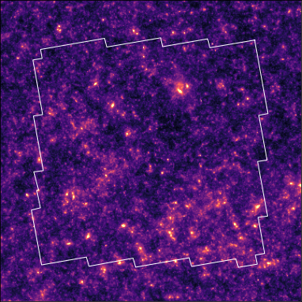
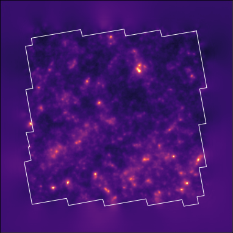
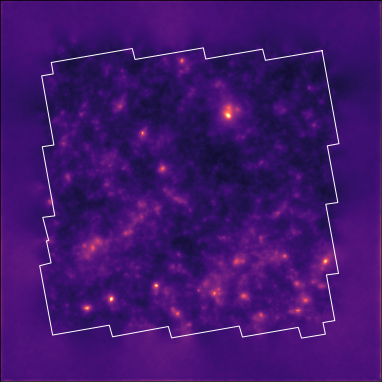
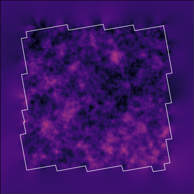
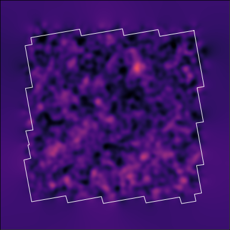

# jax-lensing
A JAX package for gravitational lensing 

[](https://arxiv.org/abs/2011.08271) [](https://github.com/CosmoStat/jax-lensing/tree/master/LICENSE)
[](##contributors-)

This repository contains scripts and notebook to reproduce the results from the following paper:

[Probabilistic Mass-Mapping with Neural Score Estimation](https://arxiv.org/abs/2011.08271), B. Remy, F. Lanusse, N. Jeffrey, J. Liu, J.-L. Starck, K. Osato, T. Schrabback, submitted to Astronomy and Astrophisics, 2021.

You will find all the scripts and instructions to reproduce traine models, sample maps and reproduce the paper figures [here](https://github.com/CosmoStat/jax-lensing/tree/master/papers/Remy2021).

This repository also contains implementation of the following methods:
- [`DeepLensingPosterior`](https://arxiv.org/abs/2011.08271)
- [`DeepMass`](https://arxiv.org/abs/1908.00543v2)
- [`Wiener Filter`](https://www.aanda.org/articles/aa/abs/2013/01/aa20586-12/aa20586-12.html)
- [`Kaiser-Squires`](https://ui.adsabs.harvard.edu/abs/1993ApJ...404..441K/abstract)

## Convergence posterior sampling
This package enables to sample **high resolution convergence map** from the posterior distribution in 10 GPU-minutes (on an Nvidia Tesla V100 GPU) in average. Have a look at the *annealed Hamiltonian Monte Carlo* sampling scheme bellow:


## Mass-mapping
Comparison between
`DLPosterior`, `DeepMass`, `Wiener Filter` and `KS93` methods.

| Ground truth convergence                      | `DLPosterior` samples                     |
|-----------------------------------------------|-------------------------------------------|
|  |  |

| `DeepMass`                                    | `DLPosterior` mean                        |
|-----------------------------------------------|-------------------------------------------|
|     |      |

| `Wiener Filter`                               | `Kaiser-Squires`                          |
|-----------------------------------------------|-------------------------------------------|
|       |       |


## Install

`jax-lensing` is pure python and can be easily installed with `pip`:

```
$ cd jax-lensing
$ pip install .
```

## Requirements
- [Jax](https://github.com/google/jax) [==0.2.18]
- [Haiku](https://github.com/deepmind/dm-haiku) [==0.0.4]
- [Astropy](https://github.com/astropy/astropy) [==4.2]
- [TensorFlow Probability](https://github.com/tensorflow/probability) [==0.13.0]
- [TensorFlow Datasets](https://github.com/tensorflow/datasets) [==4.3.0]
- [TensorFlow](https://www.tensorflow.org/) [==2.5.0]

## Citation

If you use `jax-lensing` in a scientific publication, we would appreciate citations to the following paper:

[Probabilistic Mass-Mapping with Neural Score Estimation](https://arxiv.org/abs/2011.08271), B. Remy, F. Lanusse, N. Jeffrey, J. Liu, J.-L. Starck, K. Osato, T. Schrabback, submitted to Astronomy and Astrophisics, 2021.


The BibTeX citation is the following:
```
@Upcomming
```

## Contributors
| [Benjamin Remy](https://www.cosmostat.org/people/benjamin-remy) | [François Lanusse](http://flanusse.net) | [Niall Jeffrey](https://nialljeffrey.github.io/) | [Jia Liu](https://liuxx479.github.io/) |
|---|:---:|---|---|
|  |   |  |   |